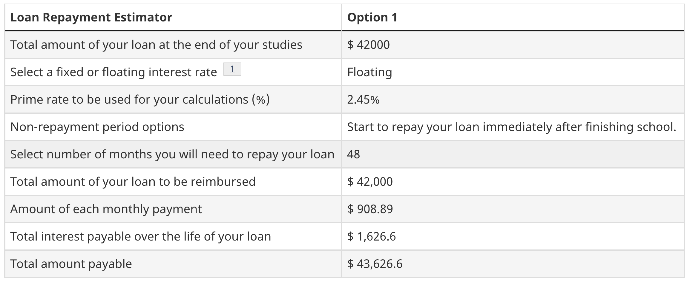

Student loans suck. You go through years of school to start your career, only to have tens of thousands in debt to pay back before you can really enjoy the life you've worked so hard to earn.

When I completed my [Master of Computer Science](/thesis), I had $42,000 in student loans. I paid back every cent in 28 months.

## What are student loans?

Roughly speaking, student loans are a debt owed for getting an education. They consist of monthly payments with interest over some period of time.

Student loans drain your income.

## Here's My Approach

To begin, I set a [SMART goal](https://www.mindtools.com/pages/article/smart-goals.htm) of **pay off $42,000 in student loans in 48 months**.

Then, I used a [student loan repayment estimator](https://tools.canlearn.ca/cslgs-scpse/cln-cln/crp-lrc/af.nlindex-eng.do) to break that goal into **monthly payments of $909**:

Now, you might imagine that paying at least $909 in student loans every month is difficult. I can assure you it was.

I had to live at home with my parents with low rent for as long as possible. I had to commute an hour each way to work. I had to delay things I looked forward to while I was a student. It sucked. And, I'm really glad I did it.

One thing I've learned time and again in life is that when we struggle, we grow. The toughest times in my life are the ones that have shaped me the most. In a way, this difficult situation gave me the motivation to pay off my debt.

Given the situation, the path forward was clear:
1. Reduce monthly payments
2. Reduce months remaining
4. Pay it all off

### Reduce Monthly Payments

Beyond my current month's payment, I paid extra each month to reduce future monthly payments. The idea was simple: Pay $1 for every month remaining to reduce all future monthly payments by $1.

So, if I had 36 months remaining, every time I paid $36 that month, I reduced all future monthly payments by $1. If I paid $72, I reduced all future monthly payments by $2, and so on.

(Technically, it's a bit more when you account for interest.)

This approach encouraged me to pay extra every month for long-term impact. If I looked at $36 on, say, $36,000, it would be just 0.1% of my entire debt. But $1 less for every future month? Suddenly, that is motivating.

I kept decreasing my future monthly payments by $1 at a time until my future monthly payments were actually quite reasonable.

Then, I focused on reducing the months remaining.

### Reduce Months Remaining

Once my monthly payments were reasonable, I reduced the months remaining by paying extra monthly payments each month.

If my monthly payment was $500, then paying $1,000 in a month meant I would finish one month sooner: $500 for the current month and $500 for a future month. With every extra monthly payment, there was one less month.

(Again, technically, it's a bit more when you account for interest.)

To put more towards my debt, I looked at everything I was saving for and asked if it was worth paying interest to keep. If it was not worth the interest, the item went on hold and the money went to my debt.

It was motivating to see the timeline cut down with each extra payment.

I just kept cutting and cutting.
 
### Pay It All Off

When the debt was low enough that my net worth finally became positive, I was very tempted to take every last cent I had and pay it all off.

But, before doing that, I knew there were risks involved with having no money. What if I lost my job next month? What if some disaster came up? What if I really needed some money? Things go wrong all the time.

So, I saved up a bit more money to keep an [emergency fund](https://www.daveramsey.com/dave-ramsey-7-baby-steps/).

Then, I paid off every cent all at once. It was wonderful.

## In Closing

By reducing monthly payments and months remaining, you may be able to pay your student loans off sooner than expected. Turning small contributions into long-term impact may produce the motivation you need to succeed.
